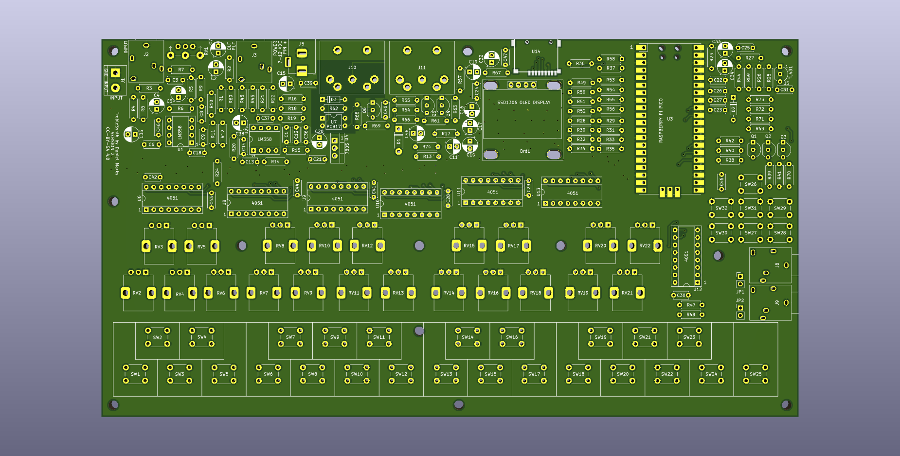

# Treble Synth

The TrebleSynth is a "Modular Synth on a Chip" based on the Raspberry Pi Pico.  It is a through-hole design that is easy to assemble yourself and uses only inexpensive generic parts that are widely available to minimize costs.  One can create various modules on the chip and interconnect them by specifying which unit takes input from another input, assign the controls of these modules to potentiometers, and then adjust the potentiometers to achieve your desired sound.  It also has a fully capable effects module on the chip as well.  The modular synth supports six note polyphony.

The synth has a 25 key, two-octave keyboard (though external MIDI controllers are highly recommended, as the built-in synth keys are rudimentary and more suitable for testing).  The TrebleSynth accepts notes over serial MIDI input and outputs the synth keyboard presses over the serial MIDI output.  There is also a USB MIDI input/output, and notes can be played from a computer to the TrebleSynth over USB and similarly the synth keyboard presses are sent over the USB MIDI output.  The are two jacks available for expression and selection pedals.

When plugged into a USB port, the TrebleSynth enumerates both as a MIDI device and a COM port.  The COM port interface has a text-based interface that may be used to read and set configuration data from a PC.   Type "HELP" for a list of the commands.  For example, typing "ECONF 0 0" lists all of the current effects configuration data, and "SCONF 0 0" lists all of the current synth configuration data.  The data is output in the form of the commands used to reprogram the same state back into the device, so these may be directly copied into a text file and pasted back into a terminal to recreate the configuration.  At some point I (or some volunteer...) could write a graphical user interface that allows external configuration of the modules.

A peculiarity of the device is that, because it uses potentiometers, when loading a saved configuration, the potentiometers may not be at the same positions when the configuration was saved.  When adjusting a potentiometer, the unit number and type of control is displayed.  In addition, initially after the configuration is loaded, the control does not adjust its corresponding parameter until the control is turned back to the original position it was at when the configuration was saved.  A symbol "\*" is shown when the control is adjusted to the point where the parameter is being adjusted again.  The symbols "<" and ">" show that the control is either at a lower or higher value than the previous control set point, and so if "<" is shown, the control should be turned up until "\*" is displayed, and likewise if ">" is shown, the control should be turned down until "\*" is displayed.

Each module has a "SourceUnit" and "ControlUnit."  The source unit is the unit that the module receives audio input from, and the control unit is the unit that the module receives parameter data from (for example, to adjust pitch for the VCO or amplitude for the VCA).  The unit number of 1 corresponds a zero-valued source (zero voltage signal source).  A unit number of 2 or above corresponds to the input received from the previous module.  So for example, a SourceUnit for 4 would be the output of unit 3 (which normally is input to unit 4, unless unit 4's SourceUnit is otherwise changed).  For example, the mixer has two SourceUnits, one of which defaults to its own unit number (so that it receives the input from the previous unit), and another that can be set to another previous unit, so that the output of these units can be combined.

The code is all licensed under the zlib license (no warranty, yes commercial and non-commercial use).  The PCB is licensed under CC-BY-SA 4.0.  A new, highly efficient, 15-bit fixed-point precision synthesizer engine, specifically suited for Cortex M0+ processors with no floating point or 64-bit integer multiply or divide, was written for this project.  Because the samples are processed in real time, the lag due to processing is about 100 microseconds.  In order to achieve this, the Pi Pico is overclocked to 250 MHz with no seemingly bad effects.

The type of modules that one can create are:

1. VCO (Voltage Controlled Oscillator).  Eight waveforms are included: sine, half-sine, triangle, sawtooth, 1/2 duty cycle square wave, 1/4 duty cycle square wave, 1/8 duty cycle square wave.  The pitch can be modulated by other modules so that FM synthesis can be performed, or vibrato effects can be created.
2. ADSR (Attack Decay Sustain Release).  A envelope module that can be used to modulate the amplitude of a signal, or output the envelope directly so that, for example, an envelope may be used to modulate the pitch of the signal.
3. Lowpass filter.  This is a up to four-pole lowpass filter modeled loosely on the 24 dB/decade Moog ladder filter.  It has an adjustable frequency cutoff.
4. LFO (Low Frequency Oscillator).  An oscillator with a frequency that does not depend on the note frequency.  This can be used, for example, to implement vibrato and tremolo effects when used to modulate other units.
5. VCA (Voltage Controlled Amplifier).  A voltage controlled amplifier that uses the output of another module to modulate the gain.  Additional gain may be applied with a VCA as well.
6. Mixer.  Can be used to combine the output signals of two modules.  For example, two separate VCO FM synthesis chains can be combined together.
7. Ring.  A ring modulator where the signal from one module four-quadrant multiplies another module.
8. Noise.  A noise source that can be used to create percussive effects.

Up to 10 modules can be used at a time.  Subtractive and FM synthesis is possible with various configurations of the modules. It also includes these effect taken from the GuitarPico ( https://www.github.com/profdc9/GuitarPico ) project:

1.  Noise Gate
2.  Delay 
3.  Room / Reverb (set up specific echoes at particular delays)
4.  Combine (mix together the signals from several effects)
5.  2nd order Bandpass filter
6.  2nd order Lowpass filter
7.  2nd order Highpass filter
8.  2nd order Allpass filter
9.  Tremolo (amplitude modulated by a low frequency oscillator)
10.  Vibrato (pitch modulated by a low frequency oscillator)
11.  Wah (bandpass filter with center frequency controlled by an external control like a pedal)
12.  AutoWah (bandpass filter with center frequency modulated by a low frequency oscillator)
13.  Envelope (bandpass filter with center frequency modulated by signal amplitude)
14.  Distortion (amplification resulting in saturation of the signal)
15.  Overdrive (selectable threshold for low signal / high signal amplitude gain)
16.  Compressor (amplifies weak signals to equal out overall amplitude of signal)
17.  Ring (ring modulator using low frequency oscillator)
18.  Flanger (pitch modulated by a low frequency oscillator, with feedback and combined with unmodulated signal)
19.  Chorus (pitch modulated by a low frequency oscillator, no feedback and combined with unmodulated signal)
20.  Phaser (signal run through multiple stages of all pass filters, combined with unmodulated signal)
21.  Backwards (plays the last samples backwards for weird swooping effect)
22.  PitchShift (allows shifting the pitch by variable amounts, useful for harmony-like effect)
23.  Whammy (pitch shift based on external control like a pedal)
24.  Octave (rectification and amplification of the signal with extreme distortion)
25.  Sinusoidal Oscillator (built in test signal source)

The effects may be cascaded, to up to 16 in a sequence.  Since the synthesizer has an audio input, at some point I will likely implement audio pass-through so the TrebleSynth can act as a guitar pedal as well like the GuitarPico.

